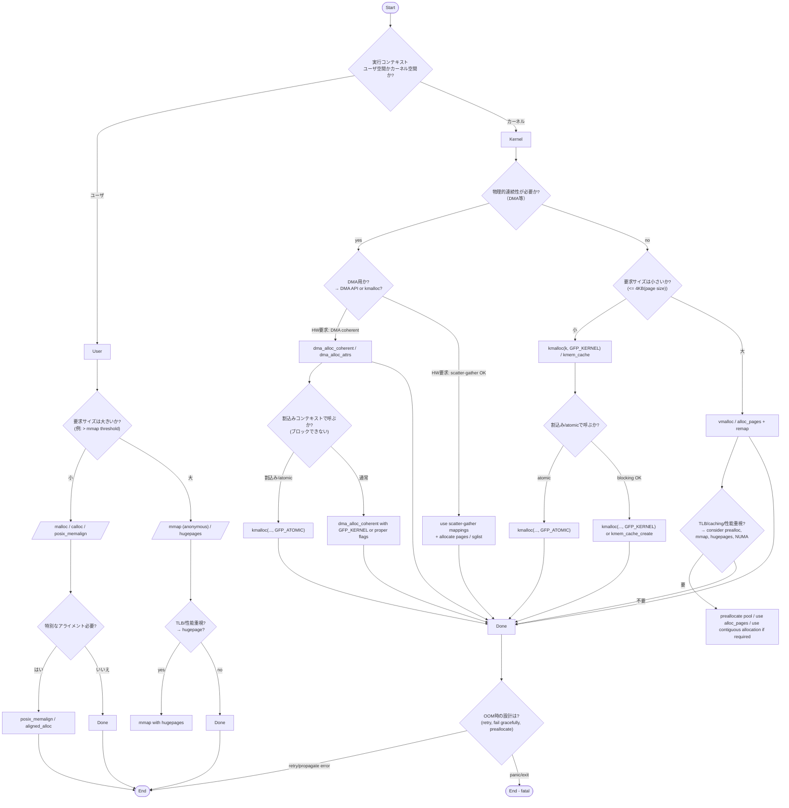

# C-lang

```mermaid
flowchart TD
  Start([Start])
  Start --> Context{"実行コンテキスト\nユーザ空間かカーネル空間か?"}
  Context -->|ユーザ| User
  Context -->|カーネル| Kernel

  %% ユーザ空間枝
  User --> U_size{"要求サイズは大きいか?\n(例: > mmap threshold)"}
  U_size -->|小| U_malloc[/"malloc / calloc / posix_memalign"/]
  U_size -->|大| U_mmap[/"mmap (anonymous) / hugepages"/]
  U_malloc --> U_align{"特別なアライメント必要?"}
  U_align -->|はい| U_posix[posix_memalign / aligned_alloc]
  U_align -->|いいえ| U_done[Done]
  U_mmap --> U_huge{"TLB/性能重視?\n→ hugepage?"}
  U_huge -->|yes| U_mmap_huge["mmap with hugepages"]
  U_huge -->|no| U_done2[Done]

  %% カーネル枝
  Kernel --> K_need_phys{"物理的連続性が必要か?\n（DMA等）"}
  K_need_phys -->|yes| K_dma_check{"DMA用か?\n→ DMA API or kmalloc?"}
  K_need_phys -->|no| K_size{"要求サイズは小さいか?\n(<= 4KB(page size))"}

  K_dma_check -->|HW要求: DMA coherent| K_dma_coherent["dma_alloc_coherent / dma_alloc_attrs"]
  K_dma_check -->|HW要求: scatter-gather OK| K_sg["use scatter-gather mappings\n+ allocate pages / sglist"]
  K_dma_coherent --> K_block{"割込みコンテキストで呼ぶか?\n(ブロックできない)"}
  K_block -->|割込み/atomic| K_kmalloc_atomic["kmalloc(..., GFP_ATOMIC)"]
  K_block -->|通常| K_kmalloc_kernel["dma_alloc_coherent with GFP_KERNEL or proper flags"]

  K_size -->|小| K_kmalloc_small["kmalloc(k, GFP_KERNEL) / kmem_cache"]
  K_size -->|大| K_vmalloc_large["vmalloc / alloc_pages + remap"]

  K_kmalloc_small --> K_block2{"割込み/atomicで呼ぶか?"}
  K_block2 -->|atomic| K_kmalloc_atomic2["kmalloc(..., GFP_ATOMIC)"]
  K_block2 -->|blocking OK| K_kmalloc_kernel2["kmalloc(..., GFP_KERNEL) or kmem_cache_create"]

  K_vmalloc_large --> K_perf{"TLB/caching/性能重視?\n→ consider prealloc, mmap, hugepages, NUMA"}
  K_perf -->|要| K_prealloc["preallocate pool / use alloc_pages / use contiguous allocation if required"]
  K_perf -->|不要| K_done_kernel[Done]

  %% Common post-processing
  K_kmalloc_atomic2 --> K_done_kernel
  K_kmalloc_kernel2 --> K_done_kernel
  K_kmalloc_atomic --> K_done_kernel
  K_kmalloc_kernel --> K_done_kernel
  K_dma_coherent --> K_done_kernel
  K_sg --> K_done_kernel
  K_vmalloc_large --> K_done_kernel

  %% Failure handling node
  K_done_kernel --> HandleFail{"OOM時の設計は?\n(retry, fail gracefully, preallocate)"}
  HandleFail -->|retry/propagate error| End1([End])
  HandleFail -->|panic/exit| End2([End - fatal])
  U_done --> End1
  U_done2 --> End1
  U_posix --> End1
```

